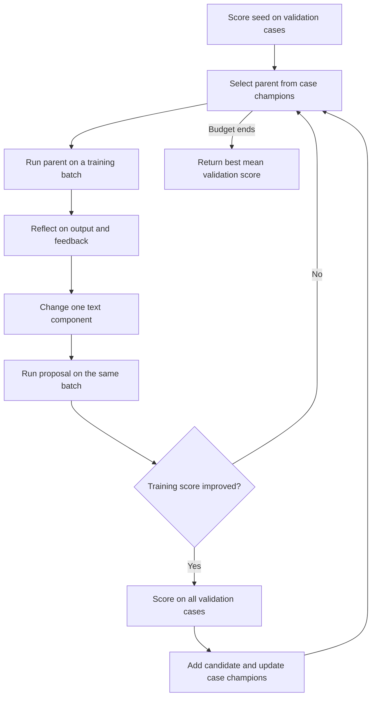

# From evolutionary search to GEPA

You can now run a small reflective prompt search in Elixir. It improves a support
request classifier and returns a prompt, scores, a candidate archive, and a trace.
Start with the offline example. Then use the same callbacks with your models.

The code is in `examples/gepa/`. `GEPAExample.Search` is an example API, not a
released `Jido.Evolve.GEPA` module. It implements the core GEPA steps. It is not
a port of all features in Python GEPA.

## 1. Run the offline example

From the package directory:

```bash
mix run examples/gepa/offline.exs
```

No API key is needed. Both the task and the reflector are deterministic fixtures.
The task reads exact rule strings. This makes each change easy to see, but the
result does not measure the quality of a language model.

The initial candidate has two text components:

```elixir
%{
  "instructions" => "Route the support request. The labels are billing, access, and general.",
  "output_format" => "Explain your answer."
}
```

The fixed metric requires exactly one correct label. The successful changes are:

| Change | Validation score |
| --- | --- |
| Initial prompt | 0/6 |
| Return only the label | 2/6 |
| Add the billing rule | 4/6 |
| Add the access rule | 6/6 |

With seed 42, the run used 87 case evaluations and 12 reflection calls. The final
test compared the initial and selected prompts on six separate cases: 0/6 and
6/6. Those 12 test evaluations are reported separately from the search budget.
The small test set follows the same simple rules as training. It is a fixture,
not evidence of broad generalization.

## 2. Use the search API

```elixir
Code.require_file("examples/gepa/search.exs")
Code.require_file("examples/gepa/routing.exs")

alias GEPAExample.{Mock, Routing, Search}
data = Routing.data()

{:ok, result} = Search.run(
  seed_candidate: Routing.seed(),
  trainset: data.train,
  valset: data.validation,
  evaluate: &Mock.evaluate/2,
  reflect: &Mock.reflect/3,
  batch_size: 3,
  max_evaluations: 120,
  max_reflections: 12,
  seed: 42
)

result.best_candidate  # Map of selected text components
result.best_score      # Mean validation score
result.archive         # Candidates, parent IDs, and scores for each case
result.frontier        # Best candidate IDs for each validation case
result.trace           # Proposals accepted, rejected, skipped, or repeated

File.write!("selected_prompt.json", Jason.encode!(result.best_candidate, pretty: true))
```

Supply two callbacks:

```elixir
evaluate = fn candidate, item ->
  output = MyTask.run(candidate, item.input)
  {:ok, %{
    score: MyMetric.score(output, item.expected),
    metadata: %{output: output},
    feedback: MyMetric.explain(output, item.expected)
  }}
end

reflect = fn candidate, component, training_records ->
  MyReflector.rewrite(candidate, component, training_records)
end
```

The reflector returns `{:ok, "complete replacement text"}` or `{:error, reason}`.

The example requires scores between 0 and 1; higher is better. Each case has a
unique string `id` and an `input` string. Extra fields belong to your evaluator.
Candidate keys and values are strings. Only the selected component can change.

Return `{:error, reason}` for a service failure. A failed evaluation stops this
example and returns `{:error, %{reason: ..., partial_result: ...}}`. A valid but
wrong answer gets a score of zero. These are different outcomes.

## 3. How the search works



The archive can keep candidates with different strengths. A candidate can remain
a parent when it ties for the best score on one case. The example samples parents
in proportion to the number of cases they win. The final choice uses the mean
validation score. This follows the core process described in the
[GEPA algorithm overview](https://dspy.ai/api/optimizers/GEPA/overview/).

The frontier is a set of per-case champions. It is not a general multi-objective
nondominated set. See [GEPA candidate selection](https://gepa-ai.github.io/gepa/guides/candidate-selection/).

`Jido.Evolve.run/1` executes each evaluation batch with `generations: 0`.
Each population member is a `{candidate, case}` pair. This reuses the package's
evaluation records, worker limits, and timeouts. The example owns the separate
search schedule and archive. A GA mutation callback alone does not provide them.

Training cases supply reflection feedback. Validation cases select candidates.
Test cases are supplied only after search finishes. Distinct IDs are checked;
you must also remove duplicate or near-duplicate content in real data.

The search reserves enough budget for a complete parent batch, proposal batch,
and validation batch before it starts a step. It can stop with unused budget.
Reflection has a separate call limit and timeout. These limits count callback
calls, not tokens, money, or HTTP retries within a model client.

Both evaluation and reflection callbacks can register external resource cleanup
with `Jido.Evolve.Cleanup.register/1`. Cleanup runs outside the callback worker,
including after a timeout. Set `cleanup_timeout` on `Search.run/1` or
`Search.evaluate_cases/4` to change its time limit (default: 1,000 milliseconds).
This is a separate, shared budget for all cleanup functions in one callback.
Cleanup runs on success as well as failure. A cleanup error or timeout stops
search and preserves the partial archive. A callback's `after` block alone
cannot clean resources after a forced stop. See the
[cleanup contract](getting-started.md#detached-work-and-cleanup) for resource
registration, startup gaps, return values, and caller responsibilities.

## 4. Use real models through ReqLLM

`live.exs` loads ReqLLM 1.21.1 through `Mix.install`. The core package does not add
a model dependency. Set `REQ_LLM_PATH` to use a compatible local checkout.
The older 1.0.0-rc.7 checkout in this workspace has a conflicting Splode dependency.

Check dependencies and the message format without a model request:

```bash
elixir examples/gepa/live.exs --check
```

Set `TASK_MODEL` and `REFLECTION_MODEL` to model specifications accepted by your
ReqLLM checkout. Set the provider API key through the provider's normal environment
variable. Then run:

```bash
elixir examples/gepa/live.exs
```

The live runner allows up to 60 search case evaluations and four reflection calls,
then 12 final test evaluations. It prints the measured scores and the selected
prompt. Improvement is not guaranteed. The live model path has a dependency and
message-format check; no paid model run was used to produce the fixture results.

The adapter connection is small:

```elixir
evaluate = GEPAExample.Models.evaluator(task_generate)
reflect = GEPAExample.Models.reflector(reflection_generate)
```

Each generation function accepts a list of messages and returns `{:ok, text}` or
`{:error, reason}`. The task receives the prompt and input. The scorer receives the
reference answer. The reflector receives the selected training records.

## 5. Apply it to Jido

| Your target | Candidate | Evaluation outcome |
| --- | --- | --- |
| Support routing | Instructions and output format | Correct labels on fixed cases |
| Tool use | Agent instructions and tool descriptions | Successful tasks and valid tool calls |
| HTN planning | Planner instructions or text policy | Valid plans that pass fixed external cases |

For your first real experiment, replace the six-case fixture with your task data
and replace the task callback with your Jido execution path. Keep the metric and
data fixed during each run. Review the selected prompt and its test results before
using it in an application.

Use `selection: :current_best` for a reflective hill-climbing baseline under the
same limits. Record actual case calls, reflection calls, and provider usage when
you compare runs. The offline example is not a comparison against Python GEPA.

The next package decision is whether to support this schedule as a public API.
First compare it with the official [Python GEPA adapter API](https://gepa-ai.github.io/gepa/guides/adapters/)
on one real Jido task. The example omits GEPA's merge operations, frontier pruning,
caching, partial validation, checkpoint/resume, and broader strategy options.
Its component rotation is global. A supported native port needs explicit behavior
and tests for the selected features. These examples do not change the GA release scope.
